# Bing Weather 4.53 复现旧版动态磁贴

>安装包在dist里。
效果最好的是OpenMeteo.BingWeather453OldTile_4.53.41681.0_x64

这是一个用于继续改造 Microsoft/Bing Weather 早期 UWP 客户端的项目。当前方案以 Bing Weather 4.53 作为可运行底包，通过4.53版本原生API提供天气数据和动态磁贴 XML

## 效果预览

<p>
  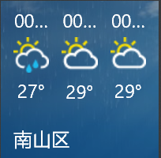
  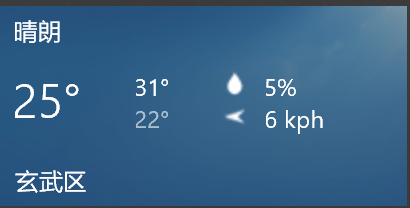
  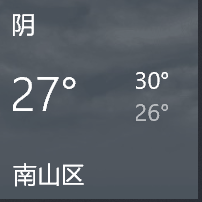
  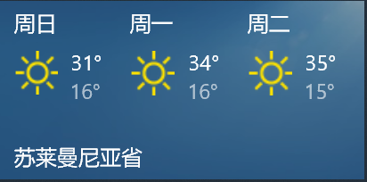
  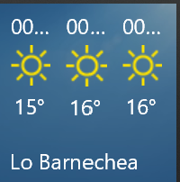
  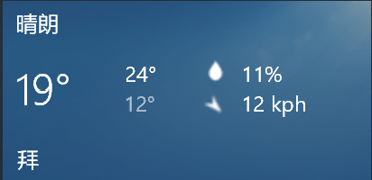
  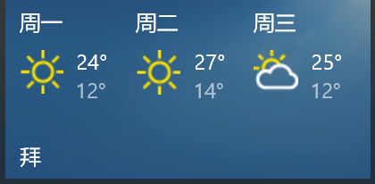
  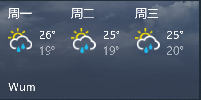
  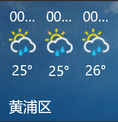
  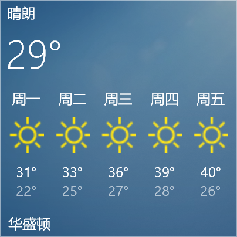
  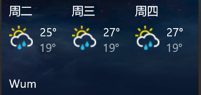
  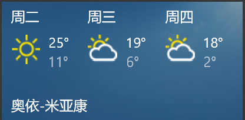
  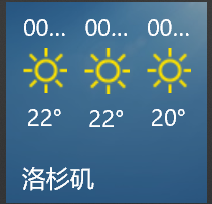
  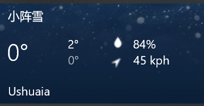
   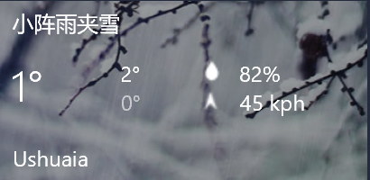
</p>

## 当前状态

- 修改版 AppX 已经打包在 `dist/` 目录。
- 已包含安装、启动、健康检查、磁贴 XML 预览和重新打包脚本。

## 目录结构

```text
.
├─ adapter/
│  └─
│     ├─ 
│     ├─ Start-Adapter.ps1              启动本地服务
│     ├─ Enable-WeatherLoopback.ps1     启用 UWP loopback
│     ├─ WeatherIcons/30x30/            4.46 风格小天气图标
│     └─ WeatherImages/eather453LocalTile_Adapter.zip
│  └─ OpenMeteo.BingWeather453Visual.Local.cer
├─ docs/
│  ├─ PROJECT_HANDOFF.md                项目交接总结
│  └─ TECHNICAL_NOTES.md                技术说明  
   ├─ preview-tile-xml.bat              预览动态磁贴 XML
   ├─ repack-adapter-zip.bat            重打适配器 zip
   └─ build-github-zip.bat              打包项目 zip
```

## 使用方法

### 1. 安装

在 Windows 10/11 上直接运行.appx文件即可安装

安装完成后，建议将天气磁贴从开始菜单取消固定，再重新固定一次，以避免 Windows 继续显示缓存的旧磁贴。

### 2. 手动启动适配器

如果动态磁贴没有更新，可以手动启动本地服务：

bat
scripts\start-adapter.bat

重打适配器 zip：
bat
scripts\repack-adapter-zip.bat


## 已知问题

- Windows 开始菜单可能缓存旧磁贴，安装后需要取消固定并重新固定。
- 本地适配器必须保持运行，否则动态磁贴可能空白或回退到静态磁贴。
- 当前仓库包含已经打好的 AppX，没有完整自动重建 AppX 的流水线。
- 如果要继续修改 AppX 内部配置，需要回到解包目录重新签名打包。

## 后续方向

- 稳定动态磁贴在不同 Windows 版本上的显示效果。
- 优化中文地点名和反向地理编码。
- 如果 adaptive tile 布局仍不够接近 4.46，可考虑由服务端直接渲染整张 PNG 磁贴图。
- 改进安装器，把证书、AppX、本地服务和计划任务做成更完整的安装流程。
